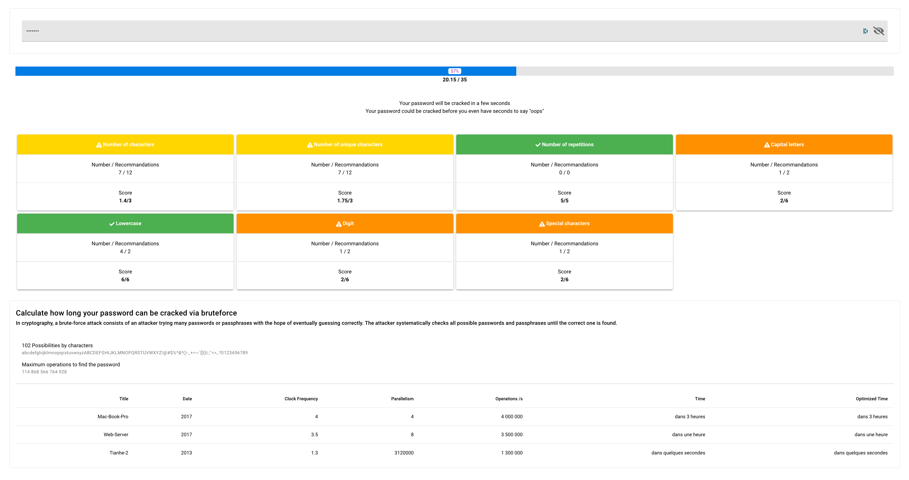

# Password-Check
[](https://travis-ci.org/Ealenn/Password-Check)   

> Password Strength Checker



## Features

- [x] ANSSI recommendations :
  - [x] Number of characters
  - [x] Single characters
  - [x] Repetitions
  - [x] Uppercase
  - [x] Lowercase
  - [x] Digit
  - [x] Special characters
- [x] Recognition of dangerous keywords
- [ ] Password dictionary
- [x] Brute Force :
  - [x] Accurate time for brute force
  - [x] Possibilities by characters
  - [x] Maximum operations to find the password
  - [x] Calculate with
    - [x] Mac Book Pro 2017
    - [x] Dedicated server
    - [x] Tianhe-2
    
## Language
- [x] Français
- [x] English

## Build Setup

``` bash
# Start dev server with hot reload
npm run dev

# Build for production with minification
npm run build

# Build for production and view the bundle analyzer report
npm run build --report
```
